Back to [README.md](./README.md)

# Big O Notation
**Objectives**:
1. State the need for Big O Notation
2. Describe what Big O notation is
3. Simpify Big O Expressions
4. Define "time complexity" and "space complexity".
5. Evaluate the "time complexity" and "space complexity" of different algorithms using Big O Notation.
6. Describe what a logarithm is


## The Need for Big O Notation
There are many ways to solve a problem. We can also have different implementations of the same solution. How do we know which algorithm is the most efficient or the best?

**We use Big O Notation to compare algorithms.**

**Big O Notation**: Used in the analysis of algorithms to measure its efficency. It establishes a way to compare and talk about algorithms, irrespective of what machine they run on. We look at the worst case scenario of the algorithm's running time.

It is a way of generalizing our code so that we can determine.

Example:
Write a function that accepts a string input and returns a reverse copy.

There are various ways to do this:
1. [Stack Overflow answers](https://stackoverflow.com/questions/958908/how-do-you-reverse-a-string-in-place-in-javascript)
2. [Analysis of ten ways to solve this](https://eddmann.com/posts/ten-ways-to-reverse-a-string-in-javascript/).

Big O Notation can be seen as a system for classifying the efficiency of code with generalized labels.

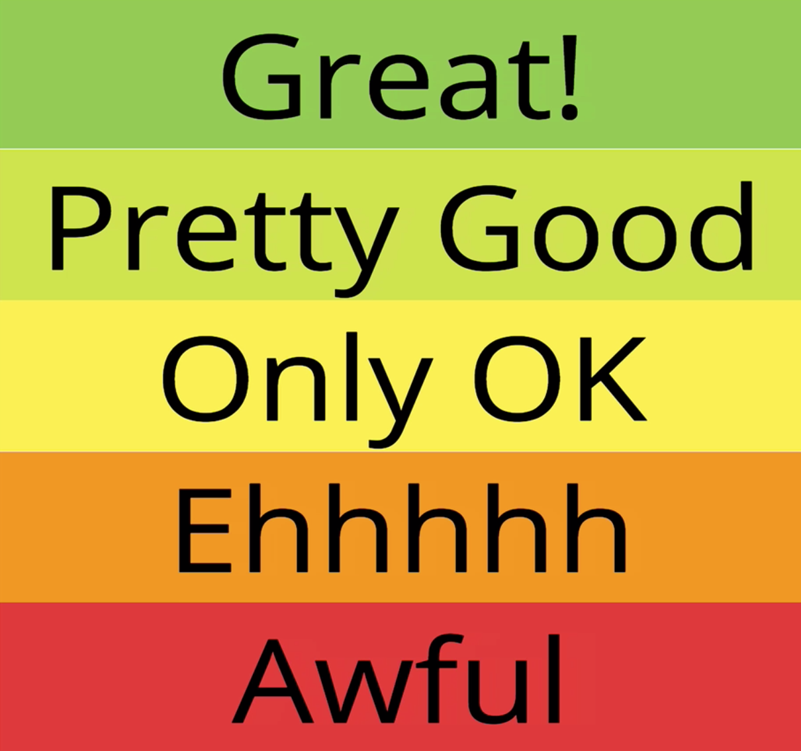
*We can compare algorithms with Big O Notation*

Instead of having color or words, we can have a **numeric representation** to measure our code.

**Why care about efficiency?**
Efficiency could mean the difference between code that takes years to complete or minutes.

If Google search was not optimized and each query took minutes, you'd use it ALOT less.

In a business context, it means saving money, time and having a competitive advantage.

**How is Big O Notation useful?**
1. Its important to have precise vocabulary to talk about code performance.
2. Useful for discussing trade offs between different approaches.
3. When your code slows down or crashes, identifying inefficient code can help find pain points to solve.
4. Comes up in interviews.

## Example Problem
Write a function that calculates the sum of all numbers from 1 up to (and including) some number *n*.

Most common solution:
```javascript
// naive solution
function addUpToNaive(n) {
  let total = 0;  // accumulator
  for (let i = 1; i <= n; i++) {
    total += i;  // loop over
  }
  return total;
}

// more optimized solution
function addUpToOptimized(n) {
  return n * (n + 1) / 2;
}
```
[see addUpTo.js](./code/addUpTo.js)
[see repl.it](https://repl.it/@tesla809/AddUpTojs)

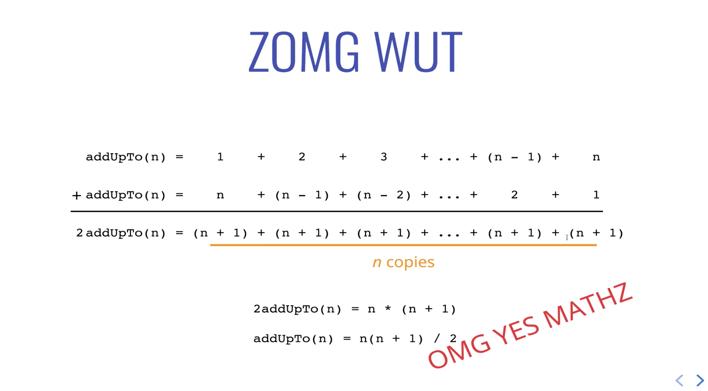
*Proof of better addition algorithm*
```addUpToOptimized()``` is less intuitive and mathematical. No loops, but there is a proof that validates that it works. Since there isn't a loop, its faster and more efficient than the naive solution.

**What does better mean?**
1. Faster?
2. Less memory intensive?
3. More readable?

It depends on the situation. Most people would choose that speed and memory intensiveness are most important. 

Usually the first two sacrifices readablity. However, you can add comments in the code and in documentation to clarify things. 

The first focus will be on evaluating speed.

**Evaluating Speed**
```javascript
// naive solution
function addUpToNaive(n) {
  let total = 0;  // accumulator
  for (let i = 1; i <= n; i++) {
    total += i;  // loop over
  }
  return total;
}

// more optimized solution
function addUpToOptimized(n) {
  return n * (n + 1) / 2;
}

// Using a timer a naive way to test efficiency of code
// if in browser
let t1 = perfromance.now();
addUpTo(100000000);
let t2 = performance.now()
console.log(`Time elapse: ${(t2 - t1) / 1000}seconds`);

// if in NodeJS
const ONE_BILLION = 1000000000;

// naive solution
let t1 = process.hrtime.bigint();  // returns nanoseconds
addUpToNaive(100000000);
let t2 = process.hrtime.bigint();
console.log(`Naive Time elapse: ${parseInt(t2 - t1) / ONE_BILLION } seconds`);

// optimized solution
let t3 = process.hrtime.bigint();
addUpToOptimized(100000000);
let t4 = process.hrtime.bigint();
console.log(`Optimized Time elapse: ${parseInt(t4 - t3) / ONE_BILLION }seconds`);
```

The duration of the optimized version is SIGNIFICANTLY shorter than the naive solution. This means savings in time, money, and computation.

However, the process of manually timing things before and after is not reliable. There can be variability in execution, some computers can be faster than other. It gives us a false sense of precision. 

## The Problem with Time
1. *Different* machines will record different time.
2. The *same* machine will record different times.
3. For fast algorithms speed measurements may not be precise enough. Its hard to gauge effectiveness since we can't really difference in improvement to compare.

**Timing your code is useful, but not the most effective way to compare algorithms.** What if your code takes hours to run? There needs to be a more effective way to talk about code in general terms. So, we use Big O Notation.

## If Not Time, Then What?
**DON'T**- Count seconds, which are variable within and between machines.

**DO**- Count *number* of simple operations the computer has to perform. That remains *constant* no matter the computer specs.

## Counting Operations
**Small amount of operations equals to faster algorithm**
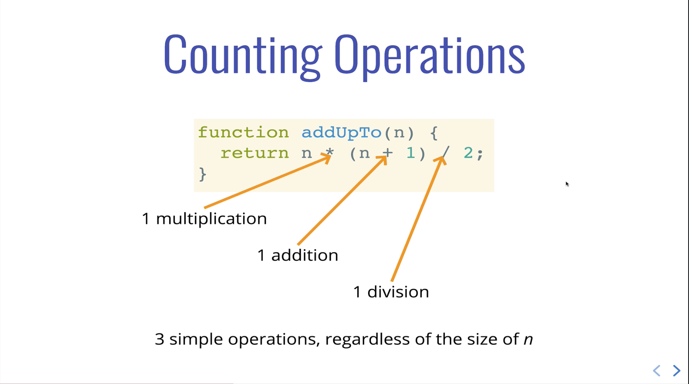
*It doesn't matter if n is 1 billion or 10. There are only **three** operations occuring.*

**More operations equals to slower algorithm**
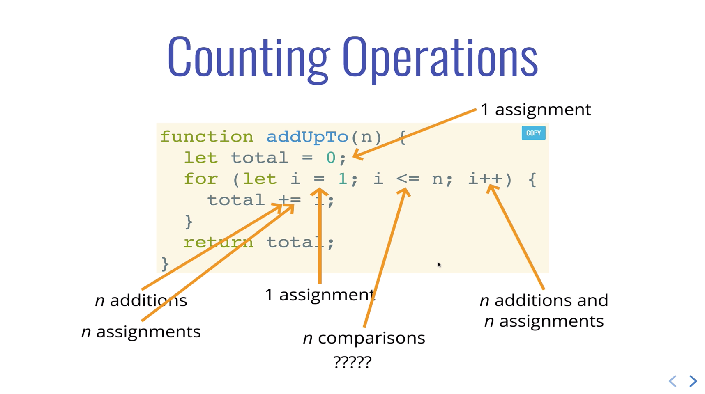

*Using a loop increases our operations to n times.*

**If we have variable amount of operations *n*, how do we count it?**

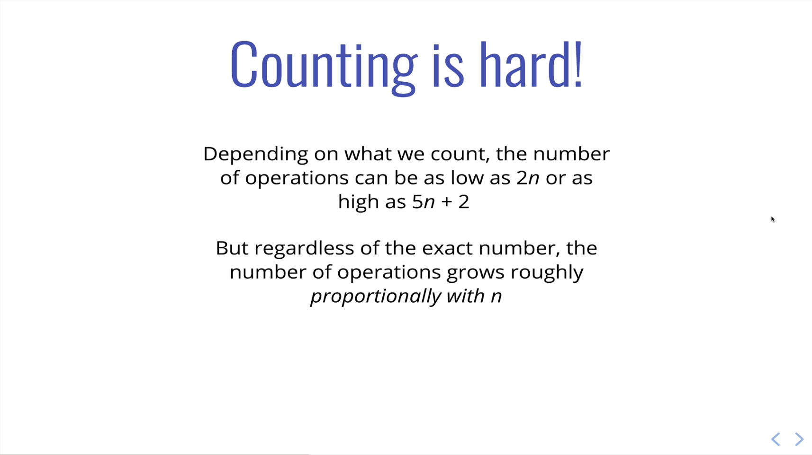

**Key Idea:**
We don't care about counting every simple step precisely. 

We focus on the big picture.

We care about the general trend of how the algorithm grows and scales.

**For our naive solution, as **n** grows, the number of operations grows roughly linearly.**

## Performance tracker
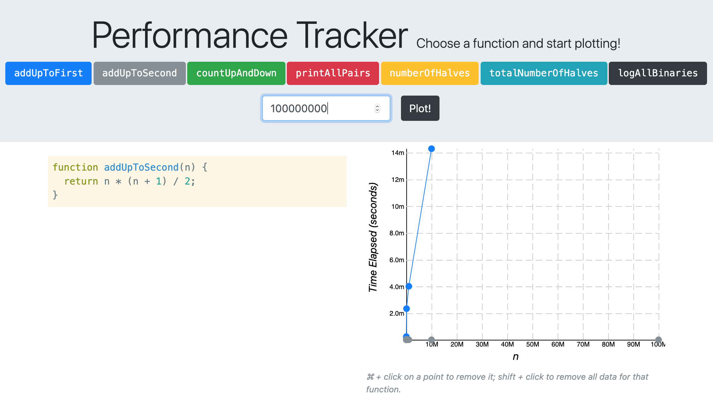
*Notice how our number of inputs grows and yet the runtime scales nearly at constant time, meaning it doesn't really change. This is the best sort of algorithm.*
[Check the Performance tracker to visually see how a select group of algoruthms scale](https://rithmschool.github.io/function-timer-demo/)


## Big O Notation
Some ways to define Big O Notation:
1. A way to formalize fuzzy counting.

2. A way of describing the relationship between the change in input and how that changes the runtime of the algorithm.

3. A way that allows us to talk formally about how the runtime of an algorithm grows as inputs grow.

4. An algorithm is **O(f(n))** if the number of simple operations the computer has to do is eventually less than a constant times **f(n)**, as n increases. The worst case scenario aka the upper bound for the  algorithm's running time is used.

## Different ways functions scale
**Constant**: f(n) = 1
As inputs grow, the runtime stays about the same. Probably the best one.

**Linear**: f(n) = n
As input grows by n, the runtime grows by n.

**Quadratic**: f(n) = n^2
As input grows by n, the runtime grows at n squared. So it gets really big, really fast.
Not the best solution.

f(n)- ???: something entirely different
¯\\_(ツ)_/¯ ????

A good way to remeber Big O Notation: When *n* grows, how does the algorithm grow with it?

## Example of Big O Notation on algorithms

```javascript
function addUpToOptimized(n) {
  return n * (n + 1) / 2;
}
```
*Always about 3 simple operations
O(1)*


```javascript
function addUpToNaive(n) {
  let total = 0;  // accumulator
  for (let i = 1; i <= n; i++) {
    total += i;  // loop over
  }
  return total;
}
```
*Number of operations is (eventually) bounded by multiple of n (i.e. 10n)
O(n)*

We don't care about the broad details, only the broad trend.

So if its 10n or 100n, it doesn't matter. Its the same at large numbers, so its N.

## Another example
```javascript
function countUpAndDown(n) {
  console.log("Going up!");
  // O(n)
  for (let i = 0; i < n; i++) {
    console.log(i);
  }
  console.log("At the top!\n Going down...");
  // O(n)
  for (let j = n - 1; j >= 0; j--) {
    console.log(j);
  }
  console.log("Back down. Bye!");
}
```
[see file](code/countUpAndDown.js)

O(n) + O(n) = O(2n) 
Since we only care about the big picture, we just generalize it to
O(n).

```javascript
// will print all the pairs from 0 to n
// 0 1, ... 1,0 ... n,n 
function printAllPairs(n) {
  // O(n)
  for (var i = 0; i < n; i++) {
    // for every n in O(n), O(n)
    // O(n) * O(n) = O(n * n) = O(n^2)
    for (var j = 0; j < n; j++) {
      console.log(i, j);
    }
  }
}
```
[see file](code/print-all-pairs-visual.js)
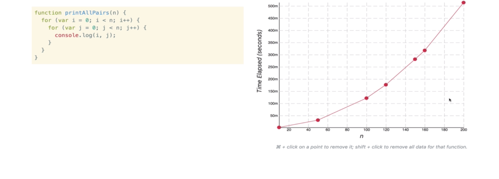

O(n) operation within an O(n) operation.
Its Nested loop. Since the loops are nested, as n grows, the number of n within n grows.
So it grows exponentially. It's runtime is f(n^2).

## Simplifying Big O Expressions 
**Rules of thumb to simplify  Big O Expressions**
As inputs scale to infinity, the constants and smaller terms don't matter.

1. Constants don't matter.
O(500) -> O(1)
O(2n) -> O(n)
O(13n^2) -> O(n^2)

2. Smaller terms don't matter.
O(n + 10) -> O(n)
O(1000n + 50) -> O(n)
O(n^2 + 5n + 8) -> O(n^2)

What matters is the leading coefficent, i.e. the highest order coefficent in the polynomial.
n^2 + 10n + 20 -> O(n^2)

**Big O shorthands**
These don't always work, but they are pretty good .

1. Arithmetic operations are constant.

2. Variable assignment is constant.

3. Accessing elements in an array (by index) or object (by key) is constant.

4. In a loop,the complexity is the length of the loop TIMES the complexity of whatever happens inside the loop.

**General Trend of algorithms**
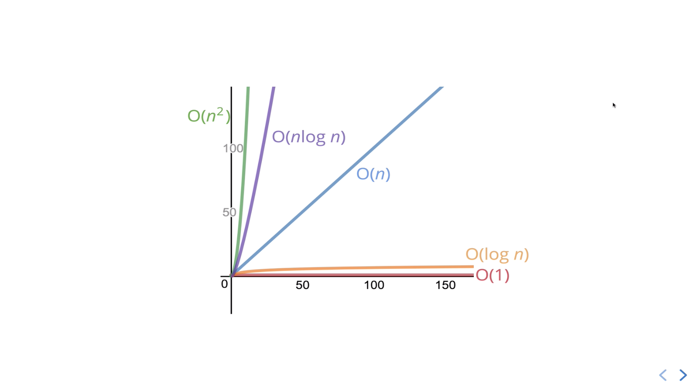

## A Couple More Examples
**Logs at least 5 or more**
```javascript
// prints numbers at a min 1-5.
// goes from either 5 or n
// which ever is larger
function logAtLeast5(n) {
  for (var i = 1; i <= Math.max(5, n); i++) {
    console.log(i);
  }
}
```
*Big O is O(n)*

[see file](code/logAtLeastAndMost5.js)

**Logs at most 5 or less**
```javascript
// prints numbers at a max 5.
// goes from either 5 or n
// which ever is smaller
function logAtMost5(n) {
  for (var i = 1; i <= Math.min(5, n); i++) {
    console.log(i);
  }
}
```
*Big O is O(1)*
[see file](code/logAtLeastAndMost5.js)

We care about what happens to *n* as it grows to infinity in its worst case scenerio.

So far we have explained Big O notation in terms of time complexity. 

**Time complexity**: How can we analyze the *runtime* of an algorithm runs as the size of the inputs increase.

## Space complexity
We can also use Big O notation to analyze space complexity.

**Space complexity**: How much additional memory do we need to allocate in order to run the code in our algorithm?

**What about the inputs**
As the n grows, the size of the input will grow. We will ignore the input. 

Sometimes you'll hear the term **auxiliary space complexity** to refer to **the space required by the algorithm, NOT including the space taken up by the inputs**.

We care about the algorithm itself, not the inputs.

Unless otherwise noted, when we talk about space we'll be talking about auxiliary space complexity. We are focusing on what happens INSIDE the algorithm, not the inputs.

## Space Complexity in JS
**Rules of Thumb**

1. Most primitives (booleans, numbers, undefined, null) are constant space.

2. Strings require O(n) space (where n is string length).

3. Reference types (arrays or objects) are generally O(n), where n is the length (for arrays) or number of keys (for objects).

**Examples of Space Complexity**
Looking at space complexity
```javascript
function sum(arr) {
  let total = 0;
  for (let i = 0; i < arr.length; i++){
    total += arr[i];
  }
  return total;
}
```
*O(1) space*
Our total number of space is two: i and total.
Total is only counted once, even though its updated.

The input amount doesn't matter, since we are looking at space taken up in the algorithm. We aren't creating new variables based on the length.

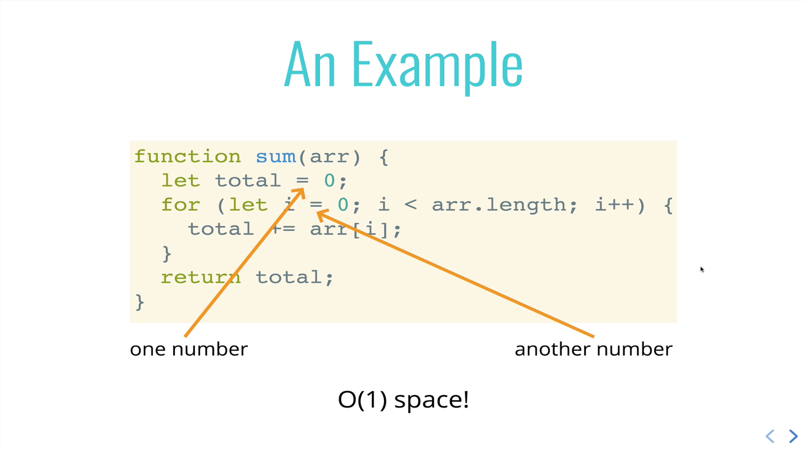

**Another example**
array directly in proportion to the input. 
```javascript 
function double(arr) {
  let newArr = [];
  for (let i = 0; i < arr.length; i++) {
    newArr.push(2 * arr[i]);
  }
  return newArr;
}
```
*O(n)*

[see file](code/doubleArr.js)
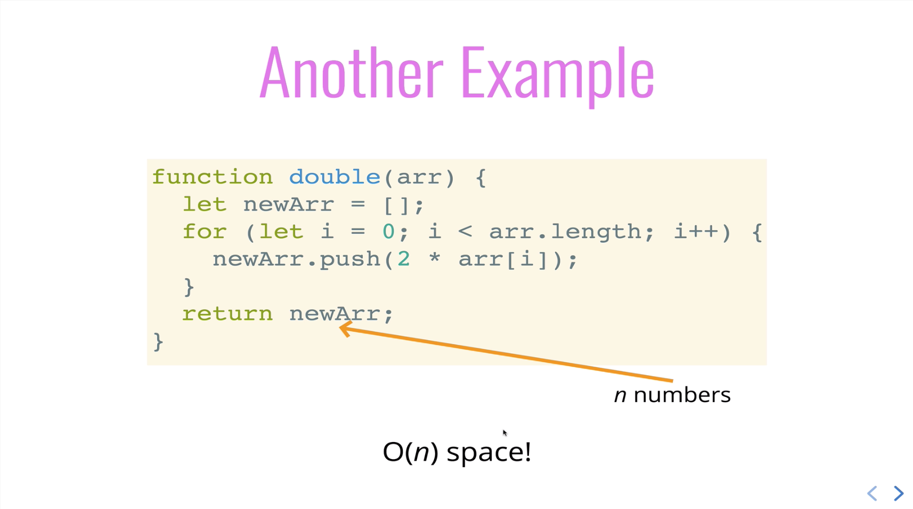

## Logarithms
Common complexities: O(1), O(n), O(n^2).

There are some other Big O expressions that have more complex math. One of those is the logarithm.

**Logarithm**: The inverse of exponentation. Logarithms and exponents are opposites of each other.

Log2(8) = 3
Can be read as:
Two to *what power* equals 8?
Or 2^x = 8 -> 2^3 = 8

logBase(value) = exponent -> base^exponent = value

The most common logorithm is log2 and log10. But it can be any number, even [logE]((see: https://en.wikipedia.org/wiki/Natural_logarithm).

We care about the big picture and omit the 2.
So, log === log2.

As the algorithm scales, the log doesn't matter. **We care about the general trend**.

The short hand is just log.

### Logorithm Rule of Thumb
The logarithm of a number *roughly* measures the number of times you can divide the number by 2 **before you get a value that's less than or equal to one**.

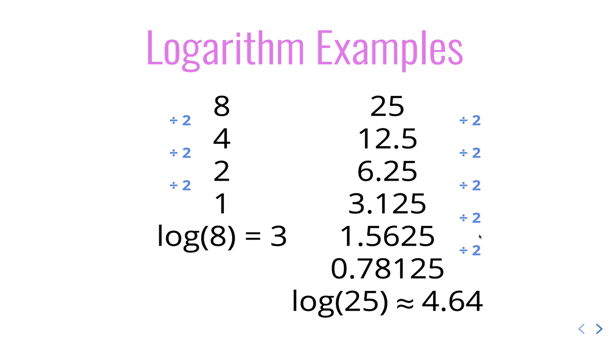

### O(log n) is Fantastic!


## Who Cares?
1. Certain searching algorithms have logarithmic time complexity.

2. Efficient sorting algorithms involve logarithms.

3. Recursion sometimes involves logarithmic space complexity.

**Stick to the picture aboe and use it for every algorithm**

## RECAP
1. We use Big O Notation to analyze the performance of an algorithm

2. Big O Notation gives a high level understanding of time or space complexity of an algorithm.

3. Big O notation doesn't care about precision, only about general trends: linear, quadratic, constant

4. Time or space complexity (measured by Big O) depends only on the algorithm, not the hardware used to run the algorithm.

5. Big O notatation is everywhere. Get lots of practice!


